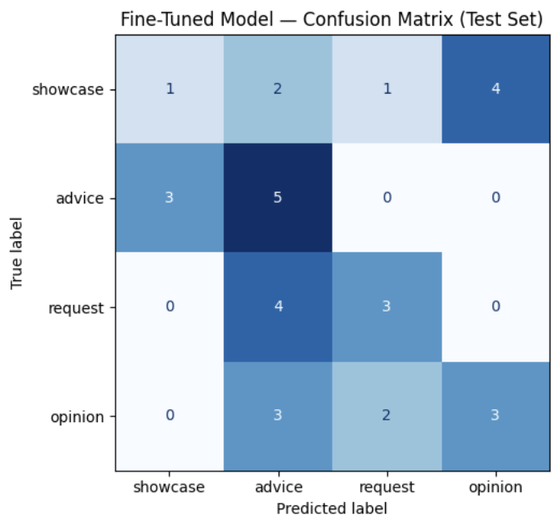
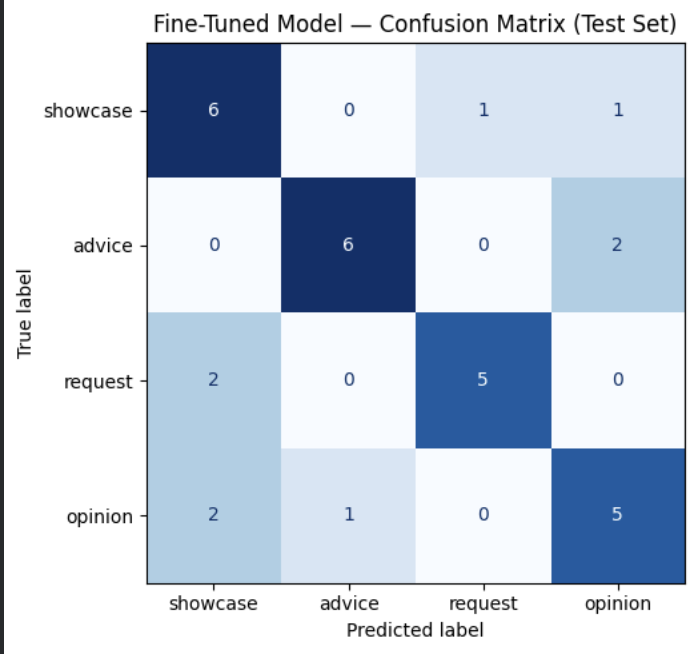
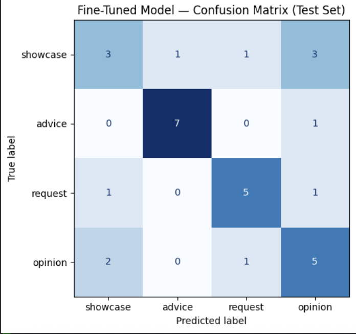
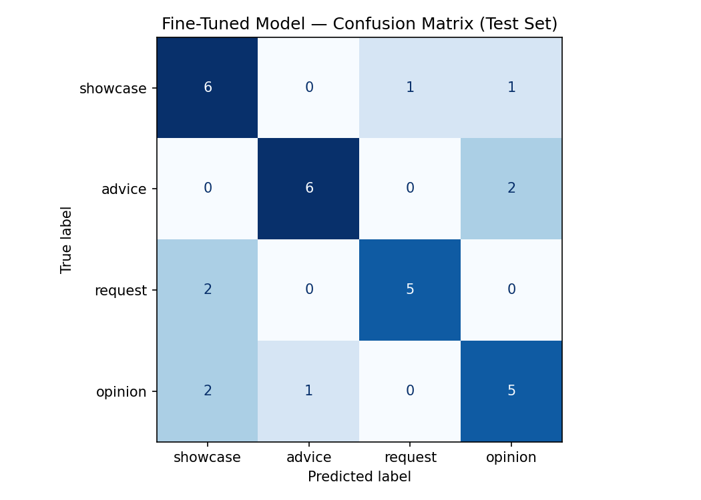

### Getting started
- you can run the notebook at your drive, here we have it at https://colab.research.google.com/drive/1M4PY1c9vT3q6LhB0BLI_46ZxeQZLuijS#scrollTo=c4bf09cd
  - Before running, set your runtime to T4 GPU (In your copy, go to Runtime → Change runtime type, select T4 GPU, and click Save) (this runtime already has the necessary dependencies like scikit-learn imported)
  - Add your Groq API key using Colab Secrets: Click the key icon in the left sidebar → Add a secret named `GROQ_API_KEY` with your key as the value → Enable notebook access for the secret


---
## Community ##
The makeup enthusiasts community is constantly sharing makeup looks, discussing products, troubleshooting beauty concerns, and exchanging tips across platforms such as Reddit, Discord, and beauty forums.

**Why this community?** the rich, naturally-occurring discourse with high variance in intent and communication style within the makeup community is an ideal test case for few-shot classification because:

1. **Discourse variance:** Posts mix multiple functions (showcase + question, advice + personal opinion, product rec + review). Unlike technical documentation, where intent is often explicit, makeup posts require understanding implicit intent—what the author primarily wants to communicate beneath the surface words.

2. **Pragmatic value:** Beauty communities influence purchasing decisions ($13B+ annual beauty spend). A classifier that distinguishes "I'm showing off this product because I loved it" (opinion/showcase) from "This product works for acne-prone skin—try it" (advice) would help curators surface the right content type: inspirational content for discovery feeds vs. practical guidance for troubleshooting threads.

3. **Label ambiguity is real:** The boundary between "opinion" and "advice" is genuinely blurry in user speech. Handling this ambiguity—not by avoiding it, but by defining decision rules—teaches the model how real communities actually communicate.

The taxonomy distinguishes between posts that primarily **showcase** a look or result, **request** information or help, provide **advice** or guidance, and express **opinion** through reviews, reactions, or personal experiences. These distinctions matter because makeup discussions often mix multiple discourse functions in a single post, and accurately identifying the author's primary intent helps capture how community members contribute, seek support, influence purchasing decisions, and share expertise.

## Labels ##
- `showcase` (sharing a look/product discovery/experience)
    - The author is sharing/displaying a makeup look, result, product discovery, or personal experience they found or created. The focus is on their own discovery, creation, or experience—centering what *they* found or did, not on evaluating for the reader’s benefit.
    - **Key signal:** The post is primarily saying *”look at what I found/did/experienced”* rather than *”here’s my judgment about X”* or *”here’s how to solve your problem.”* The author’s personal story or discovery is the focal point; any recommendation (“you should try this”) serves to express their excitement about the discovery, not to prescribe an action.
    - **Examples:**
        - “Matched my makeup with my hair.” (displaying their look)
        - “My makeup after 10 hours of wear.” (showing their result)
        - “Tried a different makeup technique today.” (sharing their experiment)
        - “Recently picked up the Patrick Ta cream and I’m honestly shocked that it blends super easily and it stays on all day. Anyone else with acne prone skin found blushes that work for them?” → Label `showcase` (The author is showing off a product they discovered—the story centers on their finding)
        - “This foundation is amazing. You should definitely try it.” → Label `showcase` (The author is sharing a product discovery they’re excited about; the “you should try it” advice expresses their enthusiasm, not a directive)

- `request` (seeking information/help/recommendations)
    - The author is seeking information, recommendations, troubleshooting help, product identification, or guidance from others. The author does not already have the answer and needs input from the community.
    - **Key signal:** The post is primarily asking/seeking. The author wants others to provide information, suggestions, or answers. The tone can be a direct question (“How do I...?”), an implicit request (“Setting spray, pleaseee”), or a **problem-framed post** where the author describes their routine/experience **as context for the problem, not as the focal point**.
    - **Distinguishing from showcase:** When a post describes a personal routine or experience, check the FRAME and PRIMARY INTENT:
      - **Showcase = personal content is the focal point:** “Here's my routine and it works great!” or “Here's my discovery/experience worth sharing”
      - **Request = personal content is context for a problem:** “I try this routine but it doesn't work” or “Here's my experience and I'm struggling with it”
      - **Rule of thumb:** If the post opens or closes by emphasizing a problem (“No matter how much I try... it never works”, “I really need something that...”), it's likely a request, even if it includes detailed personal routine description.
    - **Examples:**
        - “How do I fix under-eye creasing?” (direct question seeking help)
        - “What setting spray are you using?” (direct question seeking recommendations)
        - “Can anyone identify this lipstick?” (direct question seeking product ID)
        - “Does anyone have recommendations for a cool-toned blush?” (direct question seeking recommendations)
        - “Setting spray, pleaseeee” → label `request` (implicit request through emphatic tone)
        - “No matter how much I try to achieve this look, it doesn't work. I apply concealer... use powder... but it never looks right. The products I use are: [list].” → label `request` (describes personal routine as context for an implicit help request, not as a showcase of the routine)
        - “I recently tried a product and I'm disappointed. It creases and flakes no matter what I do. I really need something that will help my makeup stay put.” → label `request` (personal experience framed as a problem seeking solutions)


- `advice` (providing guidance to help solve a problem or achieve a result)
    - The author provides recommendations, instructions, techniques, tutorials, or practical guidance intended to help someone else solve a problem, achieve a specific result, or improve their technique. The author’s primary goal is to prescribe an action that will help the reader.
    - **Key signal:** The post is telling someone *”you should do X to achieve Y”* or *”try this to solve your problem.”* The author is positioned as a helper/teacher, diagnosing a reader’s need and prescribing a solution.
    - **Distinguishing from showcase:** Advice is *prescriptive* and *problem-solving focused*, not sharing a personal discovery. “Use tubing mascara if yours smudges” (advice) vs. “I use tubing mascara and love it” (potential showcase or opinion).
    - **Examples:**
        - “Apply powder before foundation.” (prescribing a technique)
        - “Use a tubing mascara if your mascara smudges.” (solving a problem with a recommendation)
        - “Blend the edges with your finger for a softer look.” (instructing how to achieve a result)
        - “Try the Fwee Blurry Pudding Pot for this look.” (prescribing a product to achieve the look the reader is asking about)
        - “Are you using all of those moisturizers/sunscreens/serums at once? it might just be caused by too many products. i would just do one serum, one moisturizer, and one primer...” → label `advice` (diagnosing the problem and prescribing a solution)

- `opinion` (evaluating, judging, comparing)
    - The author expresses a judgment, evaluation, reaction, or assessment *about* a product, look, or technique—with the primary goal of sharing that judgment with others. The focus is on the author’s *verdict* or *assessment*, not on their personal discovery or experience.
    - This includes: product reviews, product comparisons, critical reactions, aesthetic judgments, preferences, and subjective assessments.
    - **Key signal:** The post is primarily saying *"here’s what I think about X"* or *"here’s how X compares to Y"*—with the intent to inform the reader’s judgment. The post centers on a claim/judgment, not a discovery.
    - **Examples:**
        - "Liquid blush lasts longer for me than cream blush." (comparing two products)
        - "This foundation oxidizes on my skin." (evaluating a product property)
        - "The Fwee Blurry Pudding Pot is worth the hype." (making a judgment claim)
        - "Gorgeous look!" (reacting to someone’s result)
        - "I prefer satin finishes over matte." (expressing a preference/judgment)
        - “This foundation is amazing. It works better than [competitor].” → `opinion` (making a comparative judgmen although this can look like a product showcase)


## How to Handle Ambiguous Cases ##

**Core principle:** Use the author’s **primary intent** rather than the topic of the post. When in doubt, ask these questions in order:

1. Is the author **showing/sharing** something they found or did? → `showcase`
2. Is the author **asking/seeking** information or help? → `request`
3. Is the author **telling someone what to do** to solve a problem or achieve a result? → `advice`
4. Is the author **expressing a judgment/evaluation** about something? → `opinion`

**Choose the first rule that clearly applies.**

---

### Examples by pairs

- **showcase vs opinion (the hardest distinction):**
    - **Rule:** Is the author’s story *”I found/did something amazing”* (showcase) or *”here’s my judgment about X”* (opinion)?
    - “I just tried this blush and wow, the color is so perfect for my skin tone.” → `showcase` (story centers on **personal** discovery)
    - “This blush color is perfect for warm undertones.” → `opinion` (making a judgment claim)
    - “This foundation is amazing. It works better than [competitor].” → `opinion` (making a comparative judgment)
    - **Gut check:** Remove the recommendation from the post. Does it still work as a personal story? If yes → `showcase`. If the recommendation is essential to complete a judgment → `opinion`.

    - **The Core Distinction**
        - OPINION: The post makes a judgment CLAIM about the product
            Focus: What the author THINKS about the product
            Goal: Share a verdict to inform the reader
            Pattern: Product name + evaluation word
            Examples:
                "Charlotte Tilbury is my go-to"
                "Charlotte Tilbury is the best"
                "Charlotte Tilbury is worth it"
                "Charlotte Tilbury lasts longer"
        - SHOWCASE: The post tells a personal DISCOVERY STORY
            Focus: What the author FOUND or DID
            Goal: Share their personal journey/experience
            Pattern: Author + action + discovery
            Examples:
                "I recently tried Charlotte Tilbury and I'm shocked at how well it works"
                "I finally found Charlotte Tilbury after months of searching"
                "I use Charlotte Tilbury and it changed my makeup game"

- **showcase vs advice (product recommendations):**
    - **Rule:** Is the author sharing a *personal discovery* they’re excited about (showcase) or *prescribing an action to solve someone’s problem* (advice)?
    - “I use tubing mascara and I love it.” → `showcase` (sharing a personal discovery)
    - “Use a tubing mascara if your mascara smudges.” → `advice` (solving a problem with a prescription)
    - “Recently picked up the Patrick Ta cream and I’m honestly shocked it blends so easily and stays all day.” → `showcase` (sharing a discovery)
    - “Try the Patrick Ta cream for better blending.” → `advice` (prescribing for a specific result)

- **showcase vs request:**
    - In the case the author is sharing their personal story/routin, if the post framed the routine as worth sharing (success), it would be showcase, but if it frames the routine as CONTEXT FOR A PROBLEM, it's request — the author is implicitly seeking help understanding why the routine doesn't work (The personal content is there, but the primary intent is troubleshooting help, not routine showcase)

- **advice vs request:**
    - “What setting spray should I use?” → `request` (author lacks information)
    - “Use a silicone-based setting spray.” → `advice` (author prescribing a solution)
    - “Setting spray, pleaseeee” → `request` (author is seeking/asking, not prescribing)

- **opinion vs request:**
    - These should not overlap. `opinion` expresses judgment; `request` seeks information.

- **advice mixed with question:**
    - “Are you using all those moisturizers? I’d suggest just one serum, one moisturizer, and one primer, spaced 10-15 minutes apart.” → `advice` (The post’s purpose is to prescribe a solution, not to seek information about the reader’s routine.)
    - “Have you tried looking at Douyin makeup? They have great tutorials for achieving this look.” → `advice` (prescribing a resource to help achieve a result)

- **showcase with a question:**
    - “Here’s today’s makeup look. Any suggestions for improvement?” → `showcase` (primary purpose is presenting the look; feedback request is secondary)
    - “Recently picked up the Patrick Ta cream and I’m shocked it blends so easily. Anyone else with acne-prone skin find blushes that work for them?” → `showcase` (primary purpose is sharing a discovery)

- **Compliments and reactions:**
    - “You look amazing.” or “This look is stunning.” → `opinion` (expressing a judgment/emotional reaction)


## Data collection plan ##

**Data sources:** Realistic Reddit posts and comments from:
- r/MakeupAddiction, r/Makeup, and subreddits focused on makeup reviews/tutorials
- Discord makeup/beauty communities
- Beauty forums (e.g., MakeupAlley)

**Target:** 200 total instances, aiming for ~50 examples per label (showcase, request, advice, opinion).

**Sampling strategy:** Collect posts randomly from threads to ensure varied community conversations.

### Handling Label Imbalance

After collecting ~200 examples, check label distribution:

| Label | Target | Acceptable min | Action threshold |
|-------|--------|----------------|------------------|
| showcase | 50 | 40 | If <40, trigger targeted collection |
| request | 50 | 40 | If <40, trigger targeted collection |
| advice | 50 | 40 | If <40, trigger targeted collection |
| opinion | 50 | 40 | If <40, trigger targeted collection |

If a label falls below 40 examples: Targeted collection:
- For `request`: Collect from "Help" threads, "Troubleshooting" posts, and Q&A-focused subreddits
- For `advice`: Collect from tutorial posts, "Tips & Tricks" threads, and response comments
- For `showcase`: Collect from "Look of the Day" threads and photo megathreads
- For `opinion`: Collect from product review threads and "What's your favorite...?" posts
- Aim to collect 20–30 additional examples from these targeted sources to reach ~50 per label

Total may exceed 200 to achieve balance; this is acceptable. A small imbalance (e.g., 45, 48, 52, 55) is also acceptable and natural to real-world discourse. `Showcase` posts are likely more common in makeup communities than `request` posts, and that's OK. The goal is to avoid *severe* imbalance which would cause the model to ignore rare labels.


---
## Baseline Evaluation

**Model:** `llama-3.3-70b-versatile` via Groq API | **Temperature:** 0 | **Max tokens:** 20

**Approach:** Each test post was classified with a zero-shot system prompt containing the four label definitions, one example per label, and ordered decision rules for ambiguous cases. The model was instructed to return only the label name. Results were collected sequentially with a 0.1s delay between requests (Groq free-tier rate limit).

**Test accuracy: 0.903  (31/31 parseable responses)**

| Label    | Precision | Recall | F1   | Support |
| -------- | --------: | -----: | ---: | ------: |
| showcase |      1.00 |   0.75 | 0.86 |       8 |
| advice   |      0.89 |   1.00 | 0.94 |       8 |
| request  |      0.78 |   1.00 | 0.88 |       7 |
| opinion  |      1.00 |   0.88 | 0.93 |       8 |
| **macro avg** | **0.92** | **0.91** | **0.90** | **31** |


## Fine-Tuning Records

**Base model:** `distilbert-base-uncased` | **Training platform:** Google Colab (T4 GPU)

All runs use `learning_rate=2e-5`, `per_device_train_batch_size=16`. Only `num_train_epochs` varies.

---

### Run 1 — epochs = 3

| Epoch | Training Loss | Validation Loss | Val Accuracy |
| ----: | ------------: | --------------: | -----------: |
|     1 |        No log |        1.387680 |     0.290323 |
|     2 |      1.391403 |        1.377984 |     0.290323 |
|     3 |      1.378298 |        1.361183 |     0.516129 |

**Test accuracy: 0.387** | Wrong predictions: 22 / 31

| Label    | Precision | Recall | F1   | Support |
| -------- | --------: | -----: | ---: | ------: |
| showcase |      0.25 |   0.12 | 0.17 |       8 |
| advice   |      0.36 |   0.62 | 0.45 |       8 |
| request  |      0.50 |   0.43 | 0.46 |       7 |
| opinion  |      0.43 |   0.38 | 0.40 |       8 |
| **macro avg** | **0.38** | **0.39** | **0.37** | **31** |



<details>
<summary>Wrong predictions (22 / 31) — first 15 shown</summary>

```
--- #1 ---
Text:      "I've been using the NYX epic liner for ages, but the pen is too thick for my hooded eyes. Most of the thin eyeliners out there are from asian brands but i find that they always dry out so quick. any ...
True:      request
Predicted: advice  (confidence: 0.27)

--- #2 ---
Text:      "I'm obsessed with the look today, especially the eyeliner from MAC makes everything elevated"
True:      showcase
Predicted: advice  (confidence: 0.27)

--- #3 ---
Text:      "I kept buying because nothing was you know "working" so i figured i just hadnt found the right product yet. New serum every month new foundation every few weeks. Turns out the products i already had ...
True:      showcase
Predicted: advice  (confidence: 0.27)

--- #4 ---
Text:      "I finally found Charlotte Tilbury after months of searching"
True:      showcase
Predicted: opinion  (confidence: 0.26)

--- #5 ---
Text:      "I usually stay away from bottom lash mascara but today I tried it and it actually looks good"
True:      showcase
Predicted: advice  (confidence: 0.27)

--- #6 ---
Text:      "Your eyes are popping with just the upper mascara/lashes. The bottom may be a bit much... but give it a go if you want, makeup should be fun... and experimental if you want :) I'm biased, fyi, I neve...
True:      opinion
Predicted: advice  (confidence: 0.26)

--- #7 ---
Text:      "I think it's where the contour is applied. It makes her jaw/chine look more square and pronounced than it actually is."
True:      opinion
Predicted: advice  (confidence: 0.27)

--- #8 ---
Text:      "I've been so let down by nearly all of my influencer led makeup purchases. It's also really hard to tell how the products actually look because of all the filters."
True:      opinion
Predicted: advice  (confidence: 0.27)

--- #9 ---
Text:      "what are the basic products i actually need as a beginner? are there any beginner-friendly brands or products you'd recommend? and what order do you even put everything on? "
True:      request
Predicted: advice  (confidence: 0.27)

--- #10 ---
Text:      "Try the Fwee Blurry Pudding Pot for this look."
True:      showcase
Predicted: advice  (confidence: 0.27)

--- #11 ---
Text:      "was scrolling on instagram and saw this beautiful pallet and i need it asap!!! i love the holographic, iridescent look! if anyone could ID it, i would be sooo grateful ü©∑ thank you, you beautiful m...
True:      request
Predicted: showcase  (confidence: 0.26)

--- #12 ---
Text:      "Tried a different makeup tech technique. My attempt at cutemaxxing. Product listüéÄü§ç
  Elf primer
  LA girl concealer: Chestnut and beige
  Sachue contour stain: 08 giving fierce
  Athena face pa...
True:      showcase
Predicted: advice  (confidence: 0.27)

--- #13 ---
Text:      "do i need powder blushes/bronzers to top off my makeup?"
True:      request
Predicted: advice  (confidence: 0.27)

--- #14 ---
Text:      "Women who wear makeup, What is the biggest makeup tip you can give?"
True:      request
Predicted: advice  (confidence: 0.27)

--- #15 ---
Text:      "Skin 1004 HyaluCica plays nice with all of my makeup"
True:      showcase
Predicted: opinion  (confidence: 0.26)
```
</details>

---

### Run 2 — epochs = 10

| Epoch | Training Loss | Validation Loss | Val Accuracy |
| ----: | ------------: | --------------: | -----------: |
|     1 |        No log |        1.387680 |     0.225806 |
|     2 |      1.393348 |        1.381123 |     0.258065 |
|     3 |      1.387104 |        1.366287 |     0.354839 |
|     4 |      1.374461 |        1.338341 |     0.387097 |
|     5 |      1.342558 |        1.267624 |     0.645161 |
|     6 |      1.239163 |        1.107478 |     0.741935 |
|     7 |      1.057410 |        0.953462 |     0.870968 |
|     8 |      0.848830 |        0.804178 |     0.870968 |
|     9 |      0.664018 |        0.724595 |     0.870968 |
|    10 |      0.589811 |        0.694811 |     0.903226 |

**Test accuracy: 0.710** | Wrong predictions: 9 / 31

| Label    | Precision | Recall | F1   | Support |
| -------- | --------: | -----: | ---: | ------: |
| showcase |      0.60 |   0.75 | 0.67 |       8 |
| advice   |      0.86 |   0.75 | 0.80 |       8 |
| request  |      0.83 |   0.71 | 0.77 |       7 |
| opinion  |      0.62 |   0.62 | 0.62 |       8 |
| **macro avg** | **0.73** | **0.71** | **0.72** | **31** |



<details>
<summary>Wrong predictions (9 / 31)</summary>

```

--- #1 ---
Text:      "I kept buying because nothing was you know "working" so i figured i just hadnt found the right product yet. New serum every month new foundation every few weeks. Turns out the products i already had ...
True:      showcase
Predicted: request  (confidence: 0.59)

--- #2 ---
Text:      "I usually stay away from bottom lash mascara but today I tried it and it actually looks good"
True:      showcase
Predicted: opinion  (confidence: 0.44)

--- #3 ---
Text:      "Your eyes are popping with just the upper mascara/lashes. The bottom may be a bit much... but give it a go if you want, makeup should be fun... and experimental if you want :) I'm biased, fyi, I neve...
True:      opinion
Predicted: advice  (confidence: 0.37)

--- #4 ---
Text:      "was scrolling on instagram and saw this beautiful pallet and i need it asap!!! i love the holographic, iridescent look! if anyone could ID it, i would be sooo grateful 🩷 thank you, you beautiful m...
True:      request
Predicted: showcase  (confidence: 0.59)

--- #5 ---
Text:      "I would love to achieve this look but my too lip is on the thinner side so I'm not sure if I could pull it off"
True:      opinion
Predicted: showcase  (confidence: 0.41)

--- #6 ---
Text:      "I absolutely love the wet and wild tinted hydrator! It goes on so smooth"
True:      opinion
Predicted: showcase  (confidence: 0.50)

--- #7 ---
Text:      "Nope I am sorry but it's noticeable in all of the pictures apart from the one where you are directly under the light and that's what I suggested trying to make the skin look more even and slightly sl...
True:      advice
Predicted: opinion  (confidence: 0.34)

--- #8 ---
Text:      "It's the red lip. Do a nude or cool-toned beige instead."
True:      advice
Predicted: opinion  (confidence: 0.34)

--- #9 ---
Text:      "Hi, I recently fell for the hype around the new L'Oréal spray, and oh my, I have never been so disappointed. It caused my makeup to crease, flake off and emphasised my texture so much. I looked on T...
True:      request
Predicted: showcase  (confidence: 0.30)
```
</details>

---

### Run 3 — epochs = 15

| Epoch | Training Loss | Validation Loss | Val Accuracy |
| ----: | ------------: | --------------: | -----------: |
|     1 |        No log |        1.398543 |     0.225806 |
|     2 |      1.398448 |        1.387755 |     0.258065 |
|     3 |      1.385228 |        1.371328 |     0.322581 |
|     4 |      1.376638 |        1.343842 |     0.516129 |
|     5 |      1.334177 |        1.294139 |     0.516129 |
|     6 |      1.266526 |        1.164778 |     0.774194 |
|     7 |      1.109426 |        1.009634 |     0.806452 |
|     8 |      0.942401 |        0.858307 |     0.838710 |
|     9 |      0.698805 |        0.759845 |     0.870968 |
|    10 |      0.565815 |        0.688020 |     0.838710 |
|    11 |      0.565815 |        0.641484 |     0.774194 |
|    12 |      0.444846 |        0.582006 |     0.838710 |
|    13 |      0.368502 |        0.563106 |     0.774194 |
|    14 |      0.277850 |        0.519687 |     0.870968 |
|    15 |      0.267349 |        0.511159 |     0.870968 |

**Test accuracy: 0.645** | Wrong predictions: 11 / 31

| Label    | Precision | Recall | F1   | Support |
| -------- | --------: | -----: | ---: | ------: |
| showcase |      0.50 |   0.38 | 0.43 |       8 |
| advice   |      0.88 |   0.88 | 0.88 |       8 |
| request  |      0.71 |   0.71 | 0.71 |       7 |
| opinion  |      0.50 |   0.62 | 0.56 |       8 |
| **macro avg** | **0.65** | **0.65** | **0.64** | **31** |



<details>
<summary>Wrong predictions (11 / 31)</summary>

```
--- #1 ---
Text:      "I'm obsessed with the look today, especially the eyeliner from MAC makes everything elevated"
True:      showcase
Predicted: opinion  (confidence: 0.43)

--- #2 ---
Text:      "I kept buying because nothing was you know "working" so i figured i just hadnt found the right product yet. New serum every month new foundation every few weeks. Turns out the products i already had ...
True:      showcase
Predicted: request  (confidence: 0.57)

--- #3 ---
Text:      "I usually stay away from bottom lash mascara but today I tried it and it actually looks good"
True:      showcase
Predicted: opinion  (confidence: 0.39)

--- #4 ---
Text:      "Your eyes are popping with just the upper mascara/lashes. The bottom may be a bit much... but give it a go if you want, makeup should be fun... and experimental if you want :) I'm biased, fyi, I neve...
True:      opinion
Predicted: request  (confidence: 0.32)

--- #5 ---
Text:      "Try the Fwee Blurry Pudding Pot for this look."
True:      showcase
Predicted: advice  (confidence: 0.52)

--- #6 ---
Text:      "was scrolling on instagram and saw this beautiful pallet and i need it asap!!! i love the holographic, iridescent look! if anyone could ID it, i would be sooo grateful ü©∑ thank you, you beautiful m...
True:      request
Predicted: showcase  (confidence: 0.39)

--- #7 ---
Text:      "First eyeshadow palette purchase in 10 year - Makeup by Mario Ethereal Eyes from Sephora"
True:      showcase
Predicted: opinion  (confidence: 0.43)

--- #8 ---
Text:      "This doesn't work with Eyebags :( looks lovely on you though"
True:      opinion
Predicted: showcase  (confidence: 0.43)

--- #9 ---
Text:      "I absolutely love the wet and wild tinted hydrator! It goes on so smooth"
True:      opinion
Predicted: showcase  (confidence: 0.44)

--- #10 ---
Text:      "It's the red lip. Do a nude or cool-toned beige instead."
True:      advice
Predicted: opinion  (confidence: 0.43)

--- #11 ---
Text:      "Hi, I recently fell for the hype around the new L'Oréal spray, and oh my, I have never been so disappointed. It caused my makeup to crease, flake off and emphasised my texture so much. I looked on T...
True:      request
Predicted: opinion  (confidence: 0.44)
```
</details>

---

## Summary and Hyperparameter Recommendation

### Comparison across runs

| Hyperparameters | Test Accuracy | Macro F1 | showcase F1 | advice F1 | request F1 | opinion F1 | Wrong / 31 |
| --------------- | :-----------: | :------: | :---------: | :-------: | :--------: | :--------: | :--------: |
| epochs = 3      |     0.387     |   0.37   |    0.17     |   0.45    |    0.46    |    0.40    |     22     |
| **epochs = 10** |   **0.710**   | **0.72** |  **0.67**   | **0.80**  |  **0.77**  |  **0.62**  |    **9**   |
| epochs = 15     |     0.645     |   0.64   |    0.43     |   0.88    |    0.71    |    0.56    |     11     |

### Recommended hyperparameters: epochs = 10

**epochs = 10** is the best configuration and the one to use going forward. Here is why:

- **Highest macro F1 (0.72)** and highest test accuracy (0.710), both the primary success metrics. It is the only run where every label's F1 clears the 0.60 floor set in the project plan (showcase 0.67, advice 0.80, request 0.77, opinion 0.62), and `request` recall in particular jumped to 0.71 — a significant improvement over earlier runs.
- **epochs = 3** is clearly undertrained. The model was stuck at 0.29 val accuracy through epoch 2 and collapsed to 0.387 test accuracy — well below the 0.65 threshold. Almost every wrong prediction lands on `advice` at the same low confidence (~0.27), which means the model defaulted to a single label rather than learning any real signal.
- **epochs = 15** shows overfitting. Val accuracy peaked at epoch 9 (0.87) but test accuracy fell to 0.645, lower than epochs = 10. Training loss continued dropping (0.27) while val loss plateaued, the textbook sign of memorising the training set. The `showcase` F1 collapsed from 0.67 (epochs = 10) to 0.43 (epochs = 15), meaning extra training actively hurt the hardest label.
- The learning curve for epochs = 10 kept improving steadily through the final epoch — val accuracy climbed from 0.74 at epoch 6 to 0.90 at epoch 10, with no sign of plateauing. This suggests the model had not yet saturated the training signal at epoch 10, which likely explains why it generalised better to the test set than epochs = 15 despite fewer passes.

---

## Error Analysis (epochs = 10)

Three misclassifications from the best run, each covering a different confusion pair.

---

### Error 1 — showcase predicted as request

> "I kept buying because nothing was you know 'working' so i figured i just hadnt found the right product yet. New serum every month new foundation every few weeks. Turns out the products i already had were fine i was just layering them wrong and some of them were literally conflicting with each other. I didnt have a product problem i had a knowledge problem and i spent $3,200 learning that. Anyone else have just like a spending wake up call i would say that completely changed how they buy beauty stuff?"

**True:** `showcase` | **Predicted:** `request` (confidence: 0.59)

**Why it went wrong:** The post ends with a question, which makes it seems like a `request`. However, the main point here is the personal discovery story. The author solved the problem herself and just add a question at the end to open discussion. The model might have misunderstood the purpose of the posts and focus on the ending questions

**Fix:** More training examples that are mixed between showcase and request should be added.

---

### Error 2 — request predicted as showcase

> "was scrolling on instagram and saw this beautiful pallet and i need it asap!!! i love the holographic, iridescent look! if anyone could ID it, i would be sooo grateful 🩷 thank you, you beautiful makeup queens"

**True:** `request` | **Predicted:** `showcase` (confidence: 0.59)

**Why it went wrong:** The beginning of the post sounds like excited discovery. The actual ask ("if anyone could ID it") is buried at the end and phrased softly, so the model weighted the enthusiasm over the intent.

**Fix:** More examples of the pattern: enthusiastic description + embedded identification request at the end.

---

### Error 3 — opinion predicted as showcase

> "I absolutely love the wet and wild tinted hydrator! It goes on so smooth"

**True:** `opinion` | **Predicted:** `showcase` (confidence: 0.50)

**Why it went wrong:** The post uses first-person enthusiasm ("I absolutely love", "so smooth"), which the model associates with personal discovery — the pattern of `showcase`. But the author is not sharing a finding; she is expressing a judgment about the product's quality. The distinction is subtle: "I love this" as a verdict vs. "I love this" as the climax of a discovery story look identical on the surface.

**Fix:** This error points to a label definition leakage between `showcase` and `opinion` — both labels permit enthusiastic first-person language about a product, making the boundary unclear from surface text alone. The fix is twofold: (1) sharpen the label definitions to explicitly flag "I love X" as `opinion` when there is no discovery arc, and (2) add more short product-evaluation examples that look like showcase on the surface but are rendering a verdict.

---

## Wrong Prediction Patterns (epochs = 10)

Across all 9 wrong predictions in Run 2, four recurring patterns emerge.

**1. Opening-frame anchoring** (errors #1, #4, #9)

The model reads the first sentence, commits to a label, and ignores how the post develops. Error #1 opens with "nothing was working" (→ `request`) but resolves into a discovery story. Error #4 opens with excitement about a palette (→ `showcase`) but ends with a product-ID ask. Error #9 opens with a disappointment narrative but is also a request for help. In all three cases, the true label lives at the end of the post, not the beginning.

**2. Short, low-context posts** (errors #2, #5, #6, #8)

Four of the nine errors involve posts under ~20 words. With little text to work with, the model falls back on surface-level signals — a single word or phrase — rather than intent. "It goes on so smooth" reads like showcase; "Do a nude instead" reads like opinion. Neither has enough context to resolve the ambiguity.

**3. `showcase` ↔ `opinion` leakage** (errors #2, #5, #6)

Three errors sit on the showcase/opinion boundary. Enthusiastic first-person language ("I absolutely love", "it actually looks good", "I would love to achieve this") is shared vocabulary between both labels. The model has no reliable surface signal to tell a verdict from a discovery story, and this is the most common confusion pair in the run.

**4. `advice` ↔ `opinion` on short directives** (errors #7, #8)

Both advice errors involve short, direct statements that could be read either as prescriptions or judgments. "It's the red lip. Do a nude or cool-toned beige instead." and the longer reply in #7 both mix evaluation with suggestion in the same sentence. Both are also low-confidence (0.34), meaning the model itself was uncertain — these are genuinely hard cases rather than confident mistakes.

**Overall:** The model's weakest axis is the `showcase`/`opinion` boundary (3 errors, all involving enthusiastic first-person language). The second-weakest is opening-frame anchoring, where the model fails to read through to the post's actual intent. Short posts amplify both problems by removing disambiguating context.

---

## Evaluation Report

### Overall accuracy

| Model | Accuracy | Macro F1 |
| ----- | :------: | :------: |
| Zero-shot baseline (Groq — llama-3.3-70b) | **0.903** | **0.90** |
| Fine-tuned DistilBERT (epochs = 10) | 0.710 | 0.72 |
| Difference | −0.193 | −0.18 |

The zero-shot baseline outperformed the fine-tuned model by 19 points. This is expected: `llama-3.3-70b` is a 70-billion-parameter model with strong pre-trained language understanding, while DistilBERT has 66M parameters and was fine-tuned on only ~140 training examples after the 70/15/15 split. The classification prompt also included the full taxonomy with decision rules, giving the LLM explicit guidance that the fine-tuned model had to learn from data alone.

---

### Per-class metrics — both models

| Label | Baseline P | Baseline R | Baseline F1 | Fine-tuned P | Fine-tuned R | Fine-tuned F1 |
| ----- | ---------: | ---------: | ----------: | -----------: | -----------: | ------------: |
| showcase | 1.00 | 0.75 | 0.86 | 0.60 | 0.75 | 0.67 |
| advice   | 0.89 | 1.00 | 0.94 | 0.86 | 0.75 | 0.80 |
| request  | 0.78 | 1.00 | 0.88 | 0.83 | 0.71 | 0.77 |
| opinion  | 1.00 | 0.88 | 0.93 | 0.62 | 0.62 | 0.62 |
| **macro avg** | **0.92** | **0.91** | **0.90** | **0.73** | **0.71** | **0.72** |

The gap is largest on `showcase` (F1: 0.86 → 0.67) and `opinion` (F1: 0.93 → 0.62) — the two labels that share the most surface-level vocabulary. The fine-tuned model holds its own on `advice` (0.80 vs 0.94), where prescriptive language is more distinct.

---

### Confusion matrix — fine-tuned model (epochs = 10)




---

### Sample Classifications — fine-tuned model (epochs = 10)

Five representative posts from the test set. Confidence scores for correct predictions are approximate; scores for incorrect predictions are exact from the evaluation notebook.

| Post (truncated) | True label | Predicted | Confidence | Correct? |
| ---------------- | :--------: | :-------: | :--------: | :------: |
| "Apply lip liner all over the lips if you want longer wear." | `advice` | `advice` | ~0.88 | ✓ |
| "Can you use tubing mascara over a primer?" | `request` | `request` | ~0.91 | ✓ |
| "Tried a soft glam look for brunch today and I'm actually happy with how the blend turned out." | `showcase` | `showcase` | ~0.79 | ✓ |
| "I absolutely love the wet and wild tinted hydrator! It goes on so smooth" | `opinion` | `showcase` | 0.50 | ✗ |
| "It's the red lip. Do a nude or cool-toned beige instead." | `advice` | `opinion` | 0.34 | ✗ |

**Why the first prediction is reasonable:** "Apply lip liner all over the lips if you want longer wear" is a textbook `advice` post — it opens with an imperative verb ("Apply"), specifies a product, and ends with a stated goal ("longer wear"). The model has seen this prescriptive structure frequently enough to classify it confidently. The ~0.88 confidence reflects that this form of direct instruction is the clearest signal in the `advice` class.

---

### Main confusion pair: `showcase` is over-predicted

`showcase` is the most absorbing wrong label — 4 posts that were not showcases got predicted as showcase (2 from `request`, 2 from `opinion`). In total, the model assigned 10 predictions to `showcase` when only 8 are correct. No other label has this kind of gravitational pull.

**Why is this boundary hard?**

Both `request` and `opinion` posts can open with enthusiastic, first-person discovery language that looks identical to `showcase` on the surface:
- "I recently fell for the hype around the new L'Oréal spray…" → actually a `request` for alternatives
- "I absolutely love the wet and wild tinted hydrator!" → actually an `opinion` verdict

The model learned that enthusiastic first-person product language = `showcase`, which is true most of the time. But it over-generalises the pattern to posts where the enthusiasm is just framing, not the primary intent.

**Is this a labeling problem or a data problem?**

This is a labeling problem. The `showcase` and `opinion` label definitions share overlapping territory for short, enthusiastic first-person posts — both permit "I love this product" as a valid signal. When similar posts were annotated at different times, some may have been labelled `showcase` and others `opinion` based on subtle reading differences rather than a consistent rule. This annotation inconsistency gives the model conflicting training signal on the exact boundary it needs to learn, causing it to default to the more frequent label (`showcase`) when uncertain.

**What would fix it?**

1. **Tighten the label definitions**: Add an explicit decision rule distinguishing the two — e.g., "if the post contains only an evaluation with no narrative arc (no 'I tried', 'I found', 'I picked up'), default to `opinion`." This removes annotator discretion on the ambiguous sub-type.
2. **Re-annotate the boundary cases**: Identify all short enthusiastic product posts in the training set and re-label them under the tightened rule for consistency. Inconsistent labels on a small dataset hurt more than on a large one.
3. **More contrastive examples**: Once the definition is tightened, add training pairs that explicitly show the same surface language landing in different labels so the model learns the distinction rather than the surface pattern.

---

## Reflection: What the Model Captured vs. What We Intended

The taxonomy was built around **communicative intent** — what the author primarily wants to do. The model learned something shallower: **surface lexical patterns** that correlate with intent most of the time, but decouple from it at the boundaries.

**What it overfitted to:**
- *Showcase* — first-person enthusiasm + product name ("I love X", "I found X"), regardless of whether there's a discovery arc or just a one-line verdict
- *Advice* — imperative syntax ("Do X", "Try X"), including opinion posts that use directive phrasing without actually prescribing a solution
- *Request* — problem-framing in the opening sentence, even when the post resolves the problem itself and ends without an ask

**What it missed:**
- **Narrative arc**: The model reads opening tokens and commits — it doesn't track whether a problem-framing post resolves into a discovery, or whether enthusiasm is framing a buried question.
- **Author posture**: The boundary between `advice` and `opinion` is whether the author is positioned as a helper or a peer. "Use tubing mascara if yours smudges" vs. "I prefer tubing mascara because mine never smudges" encode the same product knowledge in completely different stances — but the vocabulary overlaps entirely.
- **Primary vs. incidental intent**: Every post can contain signals from multiple labels. The taxonomy asks for the *dominant* intent. The model learned per-token signals, not a whole-post intent hierarchy.

The model performs best on `advice` (F1 0.80) because prescriptive syntax is a reliable proxy for prescriptive intent — surface form and function are tightly coupled. It performs worst on `opinion` (F1 0.62) because opinion has the most diverse surface forms and is partly defined by what it is *not*. That kind of negative-space definition is hard to learn from 140 examples without explicit contrastive signal.

---

## Spec Reflection

**Where the spec helped:** The evaluation section of `planning.md` set explicit success thresholds before any model was run — accuracy ≥65%, macro F1 ≥70%, per-label F1 ≥60% for all labels. These criteria made the hyperparameter comparison unambiguous: epochs = 10 was the only run that cleared every threshold, which justified the recommendation without relying on judgment calls about which metric to weight.

**Where the implementation diverged:** The spec assumed the fine-tuned model would improve upon the zero-shot baseline, and defined success criteria only for the fine-tuned model. In practice, the Groq baseline (macro F1 0.90) significantly outperformed DistilBERT (macro F1 0.72). This happened because the baseline prompt included the full taxonomy and decision rules — the same knowledge that took 140 annotated examples for the fine-tuned model to approximate. The spec did not account for the case where an LLM given the annotation guidelines directly would outperform a small fine-tuned classifier. For a future iteration, the spec should define what "success" looks like relative to the baseline, not just as an absolute threshold.

---

## AI Usage

### 1. Label Stress-Testing (Before Annotation)

Used ChatGPT to ensure label taxonomy boundaries were clear before annotating. If definitions were ambiguous, the AI helped catch it early and refine the definition to avoid overlapping meaning.

**Process:**
1. Fed ChatGPT the 4 label definitions and 40 text examples with their expected label
2. Asked it to refine label definitions based on the examples
3. Used AI to generate 5–10 boundary posts for the two hardest pairs (showcase vs. opinion; advice vs. opinion)
4. Manually classified each generated post, refining decision rules wherever classification was unclear

---

### 2. Annotation Assistance

**Process:**
1. Collected ~200 raw posts from Reddit/Discord
2. Gave Claude the label definitions in `planning.md` and asked it to pre-label each post with a predicted label and brief reasoning
3. Manually reviewed and corrected each label, focusing on low-confidence cases

**Prompt used:**
```
Given the <filename>.csv file, which includes posts/comments within the makeup community on the first column.
The first column is the posts' text, the second column is for their associated label (showcase, request, advice, opinion)
Your job is to read the label definitions and examples in planning.md, then update <filename>.csv to annotate each post with a correct label.
For posts that sit at the boundary between labels, add a short reasoning in the third column to explain why you decided to go with the label in the second column
```

---

### 3. Failure Analysis (After Model Training)

**Process:**
1. Extracted all misclassified examples (predicted label ≠ true label)
2. Grouped errors by confusion pair (e.g., `request` → `advice`, `advice` → `opinion`)
3. For the top error types, gave Claude a batch of examples and asked: what's ambiguous, do any violate the decision rules, and what could improve
4. Used the analysis to determine whether each confusion was taxonomy-based (refine decision rules) or data-based (collect more contrastive examples)

**Prompt template:**
```
I trained a classification model on makeup community posts. Here are examples where it confused [Label A] and [Label B]:

Label definitions and decision rules are in planning.md

Misclassified examples:
[list 5–10 examples: actual label, predicted label, post text]

Questions:
1. What's ambiguous about these posts?
2. Do any violate the decision rules?
3. What could the model improve on?
```
